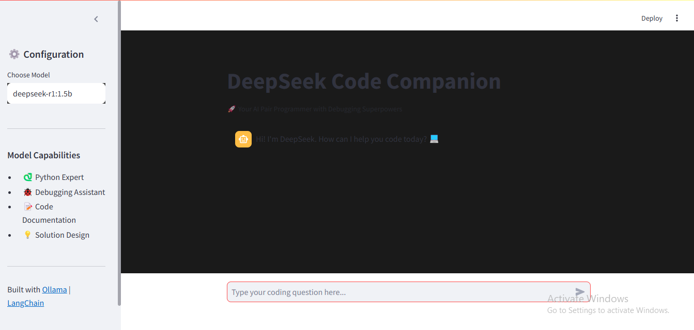

# 🚀 DeepSeek Code Companion & RAG powered Document AI

**Your AI-Powered Development and Research Assistant**

 

A Streamlit-powered dual interface combining:
1. **🧠 DeepSeek Code Companion** - Intelligent coding assistant with debugging capabilities
2. **📘 DocuMind AI** - Advanced document analysis and Q&A system

## Features

### Code Companion
- 🐍 Python expert with debugging superpowers
- 🐞 Strategic print statement suggestions
- 📝 Automated code documentation
- 💡 Solution design patterns
- 🔄 Context-aware conversation memory

### DocuMind AI
- 📄 PDF document analysis and processing
- 🔍 Semantic search capabilities
- ❓ Natural language Q&A over documents
- 🧩 Context-aware answer generation
- ⚡ Fast document chunking and indexing

## Tech Stack


- **Models Used**: 
  - `deepseek-r1:1.5b`
  - `deepseek-r1:3b`
- Embeddings: Ollama Embeddings
- Vector Store: In-Memory Vector Store
- Document Processing: PDFPlumber

## Installation

**Prerequisites**
   - Python 3.10+
   - [Ollama](https://ollama.ai/) installed and running
   - DeepSeek models installed in Ollama:
     ```bash
     ollama pull deepseek-r1:1.5b
     ollama pull deepseek-r1:3b
     ```

